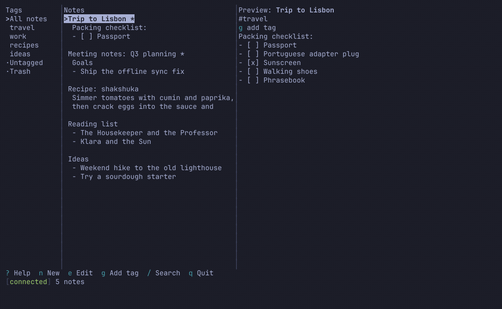
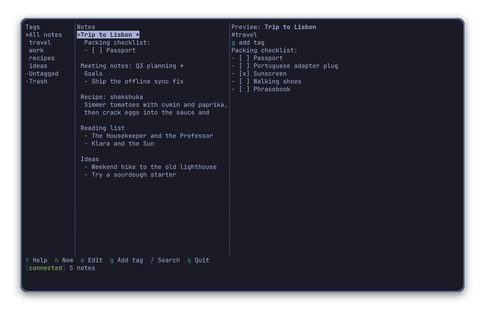
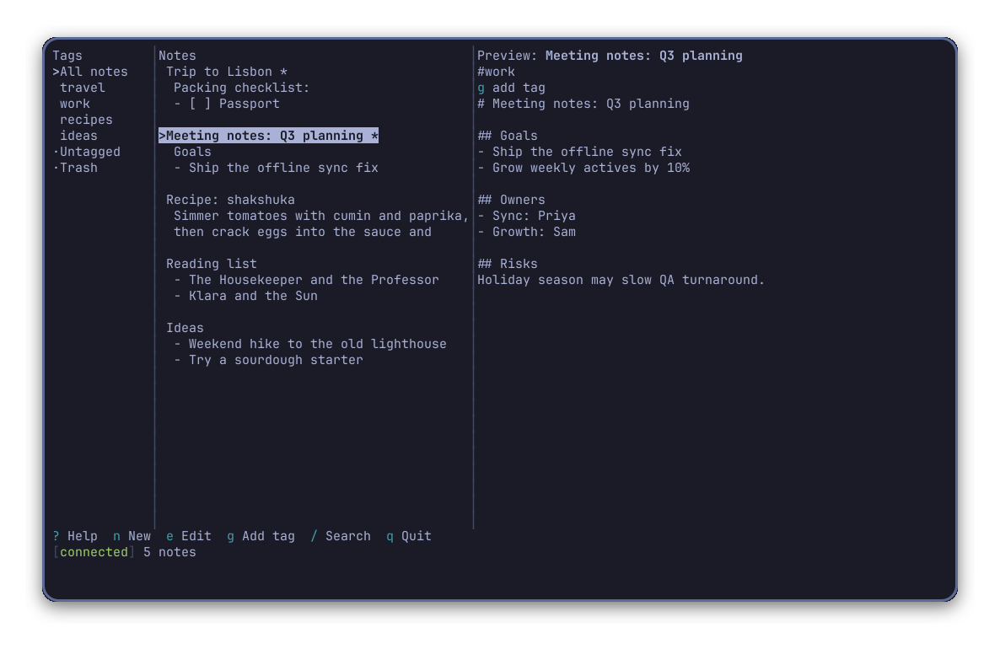
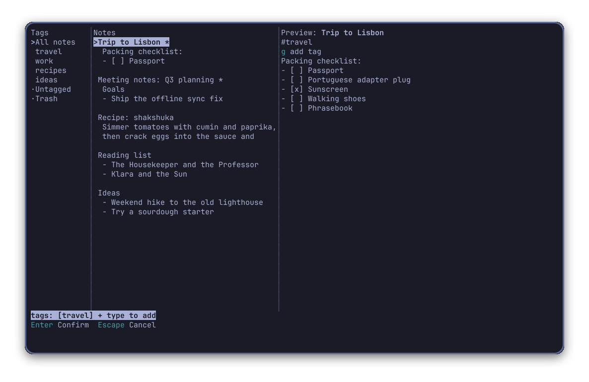
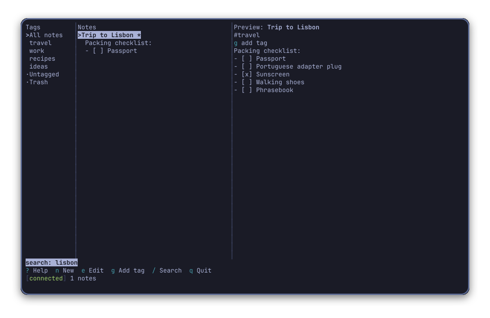
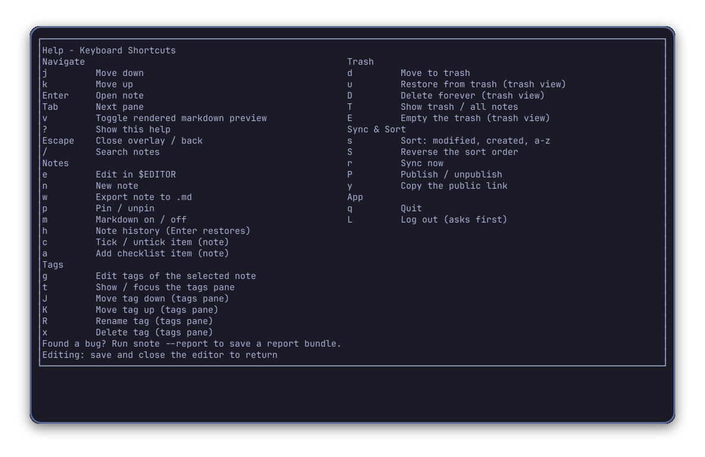
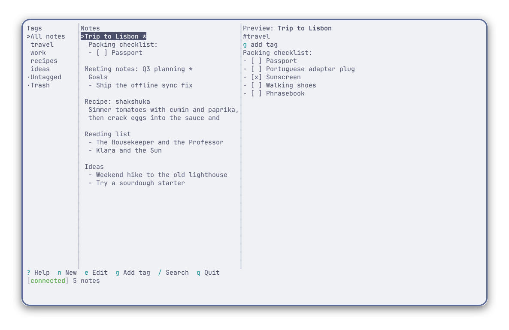

# snote — Simplenote for Omarchy

A keyboard-driven terminal client for Simplenote that reuses the official open-source sync engine
(`simperium` + the Redux sync layer from `simplenote-electron`) and adds an Omarchy-native TUI.
GPL-2.0.

snote is an unofficial, community-built Simplenote client. It is not affiliated with, endorsed
by, or supported by Automattic.



## Screenshots

| | |
| --- | --- |
|  Main three-pane view |  Rendered markdown preview |
|  Tag editor |  Search |
|  Help overlay |  Light theme |

## What it is

snote is a fast, keyboard-first Simplenote client for the terminal, built for Omarchy. It talks to
Simplenote through the same Simperium sync protocol as the official apps, so your notes, tags, and
pins stay in sync everywhere. Everything renders with your terminal's own 16 ANSI colours, so it
looks native in any theme, dark or light.

## Why

Simplenote's official apps are Electron, GTK, or web — none of them are built for a keyboard-driven
terminal workflow. snote gives you the full note-taking loop (browse, search, edit, tag, publish)
without leaving the terminal, and without shipping a browser to render a text box.

## How it works

1. **Install** it as a pacman package built from this repo, or from source (below).
2. **Launch** it from the Omarchy app menu, a Hyprland keybinding, or `snote` on the command line.
3. **Log in** with your Simplenote account — email code or password.
4. **Use the keys** in the table below; press `?` any time for the in-app reference.

## Install on Omarchy

Requires Node.js 22 or newer (Omarchy installs Node through mise; if it is missing: omarchy-install-dev-env node).

A one-click bar button is available through the Omarchy plugin marketplace:

```
omarchy plugin add https://github.com/donnishcomau/snote --enable
```

The first click builds snote from this plugin's own clone if it isn't on `PATH` yet, and adds a
`~/.local/bin/snote` shim; later clicks launch or focus it, and rebuild after a plugin update.
Remove it with:

```
~/.config/omarchy/plugins/io.github.donnishcomau.snote-simplenote/packaging/omarchy/uninstall
omarchy plugin remove io.github.donnishcomau.snote-simplenote
```

A pacman package recipe lives at `packaging/aur/PKGBUILD`, and building from a source checkout
(`npm ci`, then `npm run build`, then `sh packaging/omarchy/install.sh` for the desktop launcher)
is documented in `docs/INSTALL.md`.

Run `snote --check` to print the editor, data dir, terminal size and whether `wl-copy` and `omarchy-launch-tui` were found.

Bind a hotkey in `~/.config/hypr/bindings.lua`:
```
o.bind("SUPER + SHIFT + N", "Simplenote", "omarchy-launch-tui --app-id=TUI.float snote")
```

Colours come from your terminal theme — only the 16 ANSI colours are used.

## Pre-built plugin files

`plugin-dist/` is generated by `npm run build:plugin` from the source in this repo. The chunks are
readable (not minified); CI rebuilds and compares it on every push. Verify locally with
`node scripts/build-plugin-dist.mjs --check plugin-dist`. One chunk holds the yoga layout engine as a
base64 WebAssembly string.

## First run and login

When you first start snote you enter your email address and press Enter; a login code is emailed to you.
Type the code and press Enter to complete login. If you prefer password login, press `Tab` while on the
email screen to switch to the password step.

## Launcher

Once installed, you can launch snote from the Omarchy app menu. Open the menu, navigate to `Install > TUI`,
and select the snote entry — this invokes `<omarchy>/bin/omarchy-tui-install` to create a desktop launcher.

Alternatively, a Hyprland binding is available. The configuration includes `{ tui = "snote", focus = true }`,
which runs `omarchy-launch-or-focus-tui snote` to launch or focus the app.

## Editor

Press `e` to edit a note. By default this edits in place, in the same window, using your Omarchy default
editor — falling back to `nvim` if none is set — and returns to snote as soon as you save and quit (`:wq`
in nvim).

Omawrite, Omarchy's markdown editor, is supported as an option rather than the default: set it as your
Omarchy default editor, or set `SNOTE_EDITOR=omawrite`. Because Omawrite opens in its own window, snote
waits and shows "Editing in Omawrite — save with Ctrl+S and close its window to return".

Editor selection priority: `SNOTE_EDITOR`, then the Omarchy default-editor setting, then `nvim`, then
`EDITOR`, then `omawrite`.

Press `i` to edit inline in the preview pane instead: Enter for a new line, `Ctrl+S` to save, `Esc` to
cancel (it asks first if you have unsaved changes). `e` still opens your editor as before.

## Keys

| Key | Action |
| --- | --- |
| `j` | Move down |
| `k` | Move up |
| `Enter` | Open note |
| `Tab` | Next pane |
| `q` | Quit |
| `v` | Toggle rendered markdown preview |
| `?` | Show this help |
| `Escape` | Close overlay / back |
| `e` | Edit in $EDITOR |
| `i` | Edit inline (built-in editor) |
| `n` | New note |
| `g` | Edit tags of the selected note |
| `w` | Export note to .md |
| `b` | Send to blog as draft |
| `L` | Log out (asks first) |
| `d` | Move to trash |
| `u` | Restore from trash (trash view) |
| `D` | Delete forever (trash view) |
| `T` | Show trash / all notes |
| `E` | Empty the trash (trash view) |
| `p` | Pin / unpin |
| `m` | Markdown on / off |
| `s` | Sort: modified, created, a-z |
| `S` | Reverse the sort order |
| `/` | Search notes |
| `t` | Show / focus the tags pane |
| `J` | Move tag down (tags pane) |
| `K` | Move tag up (tags pane) |
| `R` | Rename tag (tags pane) |
| `x` | Delete tag (tags pane) |
| `r` | Sync now |
| `P` | Publish / unpublish |
| `y` | Copy the public link |
| `h` | Note history (Enter restores) |
| `c` | Tick / untick item (note) |
| `a` | Add checklist item (note) |

Press ? in the app for the current list.

## Reporting a bug

If you find a bug, run `snote --report` to generate a diagnostic file
(`report-*.json`) and attach it to your issue. See `CONTRIBUTING.md` for details
on writing good issues and how to submit pull requests.

## Credit and licence

snote vendors source code from Automattic's `simplenote-electron` client,
copyright Automattic, Inc., and is licensed under the GNU General Public License,
version 2 (GPLv2). See the `NOTICE` file for full attribution details and the
`LICENSE` file for the full licence text.

## Develop
```
npm ci
make check            # the only definition of done
npm run dev           # run from source
```

See `AGENTS.md` for the architecture, vendoring rules, and test conventions,
and `CONTRIBUTING.md` for how to open an issue or a pull request.

## Sync and data

snote syncs through Simperium, the same sync service the official Simplenote apps use,
so notes, tags, and pins stay in sync across your devices. Login is by email code or
password (see First run and login). Notes live only in Simplenote's cloud and your local
cache; snote never talks to any third-party service. Published notes are readable by
anyone who holds the https link.

## Known limitations and ideas for improvement

- Startup is above the 150 ms target with 10,000 notes; a performance pass (bench: `scripts/bench.mjs`) may bring it down.
- No bulk export; `w` exports one note at a time to a `.md` file.
- ZWJ emoji sequences (multi-codepoint emoji) may misalign; the terminal sanitizer strips variation selectors but not ZWJ.
- No image attachments.
- Editing happens in an external editor (in-window by default, or Omawrite in its own window); a built-in
  editor inside snote's own preview pane is planned for 0.2.

## Security

Please report security issues as described in `SECURITY.md`; never post credentials in a public issue.

## Keeping up with upstream Simplenote
`scripts/vendor.sh --diff` shows upstream changes to the vendored files since the pinned commit.
Port them, bump `UPSTREAM_COMMIT`, run `make check`.
